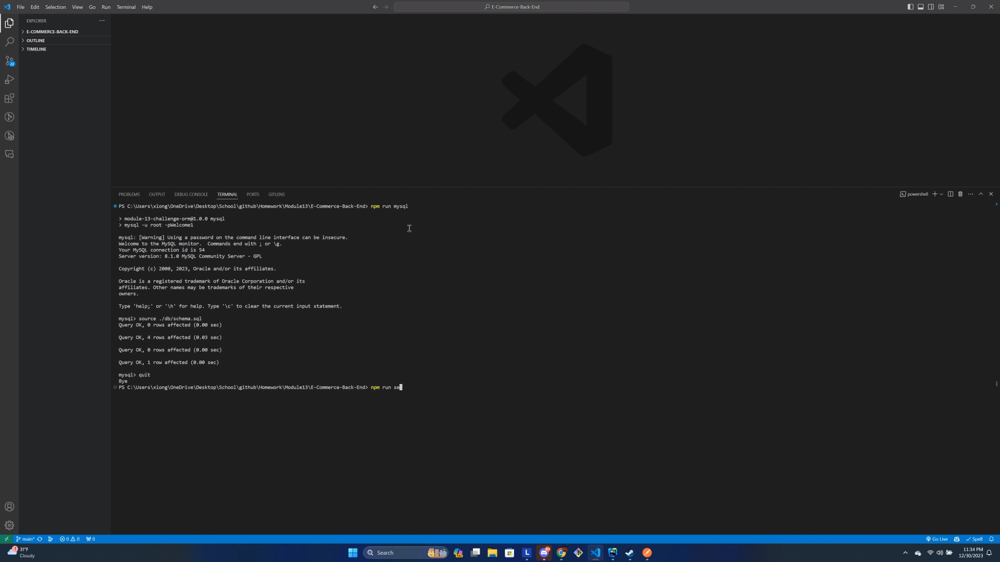
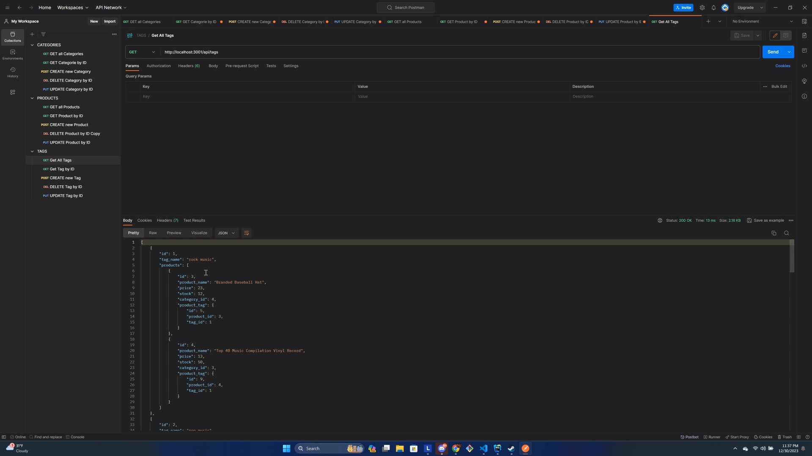

# E-Commerce-Back-End

## Description

This project is a RESTful API designed to manage an e-commerce platform's data. It was created to provide a robust backend, allowing for full CRUD operations on products, categories, and tags. The API manages complex data relationships in an e-commerce platform, making it easier to keep track of product inventory, categories, and tags. Throughout the development of this project, the primary learning outcomes were building a RESTful API using Node.js and Express.js, interacting with a MySQL database using Sequelize, and structuring data models for an e-commerce platform.

## Installation

1. Clone the repository to your local machine.
2. Navigate to the project directory.
3. Run `npm install` to install all dependencies.
4. Set up your own environment variables for your database credentials.
5. Run `npm run seed` to seed data to your database.
6. Run `npm start` to start the server.

## Usage

To use this API, send HTTP requests to the various endpoints:

- `GET /api/products`: Retrieves all products.
- `POST /api/products`: Creates a new product.
- `PUT /api/products/:id`: Updates a product with the specified ID.
- `DELETE /api/products/:id`: Deletes a product with the specified ID.

Similarly, replace `products` with `categories` or `tags` to interact with those resources.

Here's an example of what the API might look like in use:

### Screenshots:

### Video Demo:

https://watch.screencastify.com/v/Xf7TAoKx66r7Gn7GcLym